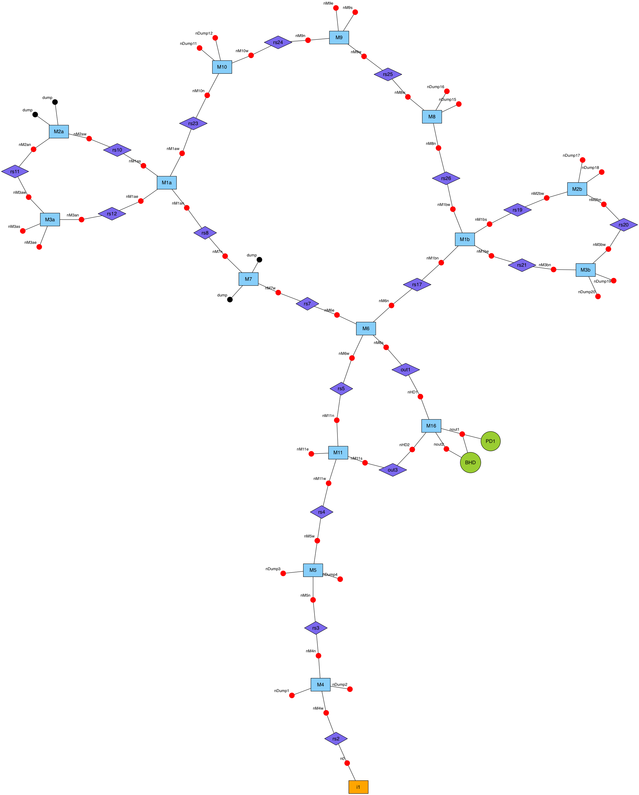

# node_graph

Small script to generate a node graph for pykat files. This should be really
helpful for debugging larger finesse simulations.

## Prerequisites

This Python script has been tested on Python 2.7 on MacOSX El Capitan.
The following Python packages are required:

  * `pykat`
  * `pygraphviz`

Both are available via `pip install`. `pygraphviz` will also need the `graphviz`
command line tool, which should be available in all the usual package managers
(eg. `brew install graphviz`).

## Example usage

```python
import node_graph
from pykat import finesse

kat = finesse.kat()
kat.loadKatFile('some_file.kat')

#node_graph.node_graph(kat, 'output.png')
node_graph.node_graph(kat, 'output.pdf')
```

An example output could look like this (PNG version):



----

S. Steinlechner, 2016
